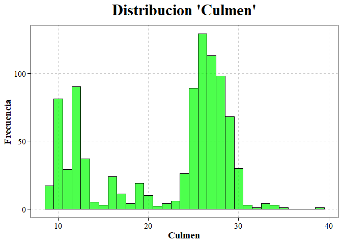
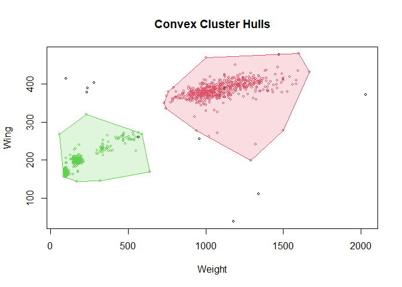

Unsupervised methods in machine learning
================
Anton Barrera Mora (<me@antonio-barrera.cyou>)
March 2023

# Introduction

## Presentation

In this project we will work with unsupervised machine learning models,
with special emphasis on the modification of parameters to refine the
results.

## Objetives

The objectives are generation, interpretation, and evaluation of a
k-means clustering model and a DBSCAN model. In doing so, we will not
overlook the phases of data preparation, model quality, and initial
knowledge extraction.

# Example 1

## k-means aggregation method with real data

We will use the ‘Hawks’ dataset, which is part of the ‘Stat2Data’
package that includes datasets used in the book ‘Stat2: Building Models
for a World of Data’ by Cannon et al. (2013a)

The dataset originated from a research project as referenced earlier
“Minería de Datos: PEC2” (2023) where measurements were taken on various
characteristics of captured and subsequently released hawks. The data
source is not clearly specified or documented in the book or on the
Oberlin University website “Digital Commons at Oberlin” (n.d.) . The
dataset package is used in the aforementioned book to provide an example
of nonparametric statistics Cannon et al. (2013a), p. 86. It is widely
used in statistics courses.

We have selected this dataset because of its potential for unsupervised
data mining algorithms. The numerical variables on which we will be
based are Wing, Weight, Culmen, Hallux

``` r
if (!require('Stat2Data')) install.packages('Stat2Data')
library(Stat2Data)
data("Hawks")
summary(Hawks)
```

    ##      Month             Day             Year       CaptureTime   ReleaseTime 
    ##  Min.   : 8.000   Min.   : 1.00   Min.   :1992   11:35  : 14          :842  
    ##  1st Qu.: 9.000   1st Qu.: 9.00   1st Qu.:1995   13:30  : 14   11:00  :  2  
    ##  Median :10.000   Median :16.00   Median :1999   11:45  : 13   11:35  :  2  
    ##  Mean   : 9.843   Mean   :15.74   Mean   :1998   12:10  : 13   12:05  :  2  
    ##  3rd Qu.:10.000   3rd Qu.:23.00   3rd Qu.:2001   14:00  : 13   12:50  :  2  
    ##  Max.   :11.000   Max.   :31.00   Max.   :2003   13:05  : 12   13:32  :  2  
    ##                                                  (Other):829   (Other): 56  
    ##       BandNumber  Species  Age     Sex          Wing           Weight      
    ##            :  2   CH: 70   A:224    :576   Min.   : 37.2   Min.   :  56.0  
    ##  1142-09240:  1   RT:577   I:684   F:174   1st Qu.:202.0   1st Qu.: 185.0  
    ##  1142-09241:  1   SS:261           M:158   Median :370.0   Median : 970.0  
    ##  1142-09242:  1                            Mean   :315.6   Mean   : 772.1  
    ##  1142-18229:  1                            3rd Qu.:390.0   3rd Qu.:1120.0  
    ##  1142-19209:  1                            Max.   :480.0   Max.   :2030.0  
    ##  (Other)   :901                            NA's   :1       NA's   :10      
    ##      Culmen         Hallux            Tail        StandardTail  
    ##  Min.   : 8.6   Min.   :  9.50   Min.   :119.0   Min.   :115.0  
    ##  1st Qu.:12.8   1st Qu.: 15.10   1st Qu.:160.0   1st Qu.:162.0  
    ##  Median :25.5   Median : 29.40   Median :214.0   Median :215.0  
    ##  Mean   :21.8   Mean   : 26.41   Mean   :198.8   Mean   :199.2  
    ##  3rd Qu.:27.3   3rd Qu.: 31.40   3rd Qu.:225.0   3rd Qu.:226.0  
    ##  Max.   :39.2   Max.   :341.40   Max.   :288.0   Max.   :335.0  
    ##  NA's   :7      NA's   :6                        NA's   :337    
    ##      Tarsus        WingPitFat        KeelFat           Crop       
    ##  Min.   :24.70   Min.   :0.0000   Min.   :0.000   Min.   :0.0000  
    ##  1st Qu.:55.60   1st Qu.:0.0000   1st Qu.:2.000   1st Qu.:0.0000  
    ##  Median :79.30   Median :1.0000   Median :2.000   Median :0.0000  
    ##  Mean   :71.95   Mean   :0.7922   Mean   :2.184   Mean   :0.2345  
    ##  3rd Qu.:87.00   3rd Qu.:1.0000   3rd Qu.:3.000   3rd Qu.:0.2500  
    ##  Max.   :94.00   Max.   :3.0000   Max.   :4.000   Max.   :5.0000  
    ##  NA's   :833     NA's   :831      NA's   :341     NA's   :343

The ‘summary()’ function in the R language provides a basic statistical
summary of variables in a dataset. For numeric variables, it returns
statistics such as minimum, first quartile (Q1), median, mean, third
quartile (Q3), and maximum. For categorical variables, it returns a
frequency table.

We will complete a first analysis using the head() function that will
allow us to obtain a snapshot of the first records in the database:

``` r
head(Hawks)
```

    ##   Month Day Year CaptureTime ReleaseTime  BandNumber Species Age Sex Wing
    ## 1     9  19 1992       13:30               877-76317      RT   I      385
    ## 2     9  22 1992       10:30               877-76318      RT   I      376
    ## 3     9  23 1992       12:45               877-76319      RT   I      381
    ## 4     9  23 1992       10:50               745-49508      CH   I   F  265
    ## 5     9  27 1992       11:15              1253-98801      SS   I   F  205
    ## 6     9  28 1992       11:25             1207-55910       RT   I      412
    ##   Weight Culmen Hallux Tail StandardTail Tarsus WingPitFat KeelFat Crop
    ## 1    920   25.7   30.1  219           NA     NA         NA      NA   NA
    ## 2    930     NA     NA  221           NA     NA         NA      NA   NA
    ## 3    990   26.7   31.3  235           NA     NA         NA      NA   NA
    ## 4    470   18.7   23.5  220           NA     NA         NA      NA   NA
    ## 5    170   12.5   14.3  157           NA     NA         NA      NA   NA
    ## 6   1090   28.5   32.2  230           NA     NA         NA      NA   NA

From the analysis of the attributes, we obtain the following information
about the variables:

- Age: Age of the hawk - young (I) or adult (A) -.

- Species: Species of the hawk - Cooper’s Hawk (CH), Red-Tailed Hawk
  (RT), or Sharp-Shinned Hawk (SS) -.

- Sex: Gender of the hawk - male (M) or female (F) -.

- Wing: Wing length of the hawk - in millimeters -.

- Weight: Weight of the hawk - in grams -.

- Culmen: Culmen length of the hawk’s beak - in millimeters -.

- Hallux: Hallux length of the hawk’s claw - in millimeters -.

At this point, there are other variables or columns in the dataset that
are irrelevant for the requirements of this work, so we will filter them
later.

Additionally, thanks to the information provided by the summary
function, we know the following:

1.  The ‘BandNumber’ variable contains unique records that help identify
    specific individuals and can be used as a primary key. We observe
    that there are two blank records without a number, so we will opt to
    create a new numeric variable.

2.  The ‘Wing’ variable contains 1 infinite or NA value. Considering
    that there are noticeable size differences depending on the age and
    species of the specimens, but this data does not correspond to a
    continuous variable but a discrete one, we will assign the mean wing
    size based on the age of the specific specimen and its species.

3.  The ‘Weight’ variable also has 10 instances with NA values. We will
    apply the same criterion as the ‘Wing’ variable. That is, we will
    assign the mean weight corresponding to its age group to each
    record.

4.  The ‘Culmen’ variable contains 7 records with NA values. We will
    apply the previously described criterion of assigning means
    according to age.

5.  The ‘Hallux’ variable also contains 6 NA records to which we will
    apply the corrective policies described earlier.

We will select the dataset of interest from the current dataset.

``` r
# We select only the variables that we are interested in working with.

hawks_select <- Hawks %>% select(BandNumber, Year, Month, Day, Species, Age, Wing, Weight, Culmen, Hallux)
```

Point 1. We correct the primary key according to the parameters set in
the plan:

``` r
# creating a new record with numbers from 1 to the total number of rows in the dataset.
hawks_select$Num_id <- 1:nrow(hawks_select)

# Verifying that all values are unique
if (length(unique(hawks_select$Num_id)) == nrow(hawks_select)) {
  cat("The values in the column 'Num_ID' are unique.\n")
} else {
  cat("The values in the column 'Num_ID' are NOT unique.\n")
}
```

    ## The values in the column 'Num_ID' are unique.

``` r
hawks_select <- subset(hawks_select, select = -BandNumber)
```

Point 2. We are going to correct the variable Wing that had a record
with no value:

``` r
# El atributo tiene un valor NA, vamos a calcular una media condicional:

media_alas_especie_edad <- aggregate(Wing ~ Species + Age, data = hawks_select, FUN = function(x) mean(x, na.rm= TRUE))

# Calculamos las medias de la columna 'Wing' para cada especie y edad, excluyendo los valores NA

# Imputamos el valor faltante en la columna 'Wing' segun la especie y la edad
# iteramos sobre cada registro usdando un bucle for empezando por 1 hasta el valor del numero de filas
# usando 'nrow'

for (i in 1:nrow(hawks_select)) {
  # Si el valor de 'Wing' que estamos buscando es NA, buscamos la media que corresponde a la especie y edad
  if (is.na(hawks_select$Wing[i])) {
    # Filtramos el 'data.frame' según la especie y edad
    media_especie_edad <- media_alas_especie_edad$Wing[media_alas_especie_edad$Species == hawks_select$Species[i] & media_alas_especie_edad$Age == hawks_select$Age[i]]
    # imputamos la media que corresponda
    hawks_select$Wing[i] <- media_especie_edad
  }
}

# Verificamos que no haya valores NA en la columna
if (!any(is.na(hawks_select$Wing))) {
  cat("Todos los valores NA en la columna 'Wing' han sido correctamente imputados")
} else {
  cat("Aun quedan valores NA en la columna 'Wing'. \n")
}
```

    ## Todos los valores NA en la columna 'Wing' han sido correctamente imputados

Point 3. We go on to correct the NA values in the ‘Weight’ table using
the same method as above. That is, we impute the mean according to age
and species:

``` r
# El atributo tiene diez registros con NA, vamos a calcular una media condicional:

media_peso_especie_edad <- aggregate(Weight ~ Species + Age, data = hawks_select, FUN = function(x) mean(x, na.rm= TRUE))

# Calculamos las medias de la columna 'Weight' para cada especie y edad, excluyendo los valores NA

# Imputamos el valor faltante en la columna 'Weight' según la especie-edad
# iteramos sobre cada registro usando un bucle 'for' empezando por 1 hasta el valor del numero de filas
# empleando 'nrow'

for (i in 1:nrow(hawks_select)) {
  # Si el valor de 'Weight' que estamos buscando es NA, buscamos la media que corresponde a la especie y edad
  if (is.na(hawks_select$Weight[i])) {
    # Filtramos el 'data.frame' según la especie y edad
    media_especie_edad <- media_peso_especie_edad$Weight[media_peso_especie_edad$Species == hawks_select$Species[i] & media_peso_especie_edad$Age == hawks_select$Age[i]]
    # imputamos la media que corresponda al registro NA
    hawks_select$Weight[i] <- media_especie_edad
  }
}

# Verificamos que no haya valores NA en la columna
if (!any(is.na(hawks_select$Weight))) {
  cat("Todos los valores NA en la columna 'Weight' han sido correctamente imputados")
} else {
  cat("Aun quedan valores NA en la columna 'Weight'. \n")
}
```

    ## Todos los valores NA en la columna 'Weight' han sido correctamente imputados

Point 4. The variable ‘Culmen’ contains 7 NA records which we will
correct using the same procedure as above, i.e. calculating the mean of
the beak dimensions according to age \> and species.

``` r
# El atributo tiene 7 registros NAs, vamos a calcular una media condicional:

media_pico_especie_edad <- aggregate(Culmen ~ Species + Age, data = hawks_select, FUN = function(x) mean(x, na.rm= TRUE))

# Calculamos las medias de la columna 'Culmen' para cada especie y edad, excluyendo los valores NA

# Imputamos el valor faltante en la columna 'Culmen' según la especie-edad
# iteramos sobre cada registro usando un bucle 'for' empezando por 1 hasta el valor del numero de filas
# empleando 'nrow'

for (i in 1:nrow(hawks_select)) {
  # Si el valor de 'Culmen' que estamos buscando es NA, buscamos la media que corresponde a la especie y edad
  if (is.na(hawks_select$Culmen[i])) {
    # Filtramos el 'data.frame' según la especie y edad
    media_especie_edad <- media_pico_especie_edad$Culmen[media_pico_especie_edad$Species == hawks_select$Species[i] & media_pico_especie_edad$Age == hawks_select$Age[i]]
    # imputamos la media que corresponda al registro NA
    hawks_select$Culmen[i] <- media_especie_edad
  }
}

# Verificamos que no haya valores NA en la columna
if (!any(is.na(hawks_select$Culmen))) {
  cat("Todos los valores NA en la columna 'Culmen' han sido correctamente imputados")
} else {
  cat("Aun quedan valores NA en la columna 'Culmen'. \n")
}
```

    ## Todos los valores NA en la columna 'Culmen' han sido correctamente imputados

Point 5. The variable ‘Hallux’ contains another suitable number of NA
records. We apply the corrective policies previously implemented:

``` r
# El atributo tiene 6 registros NAs, vamos a calcular una media condicional.
# Calculamos las medias de la columna 'Hallux' para cada especie y edad

media_espolon_especie_edad <- aggregate(Hallux ~ Species + Age, data = hawks_select, FUN = function(x) mean(x, na.rm= TRUE))


# Imputamos el valor faltante en la columna 'Hallux' según la especie-edad, iteramos sobre cada registro # usando un bucle 'for' empezando por 1 hasta el valor del numero de filas empleando 'nrow'

for (i in 1:nrow(hawks_select)) {
  # Si el valor de 'Hallux' que estamos buscando es NA, buscamos la media que corresponde a la especie y edad
  if (is.na(hawks_select$Hallux[i])) {
    # Filtramos el 'data.frame' según la especie y edad
    media_especie_edad <- media_espolon_especie_edad$Hallux[media_espolon_especie_edad$Species == hawks_select$Species[i] & media_espolon_especie_edad$Age == hawks_select$Age[i]]
    # imputamos la media que corresponda al registro NA
    hawks_select$Hallux[i] <- media_especie_edad
  }
}

# Verificamos que no haya valores NA en la columna
if (!any(is.na(hawks_select$Hallux))) {
  cat("Todos los valores NA en la columna 'Hallux' han sido correctamente imputados")
} else {
  cat("Aun quedan valores NA en la columna 'Hallux'. \n")
}
```

    ## Todos los valores NA en la columna 'Hallux' han sido correctamente imputados

Before going on to check the tables and variables created and modified,
let’s round to one decimal place.

``` r
# Copia de seguridad

hawks_select_copy <- hawks_select

# Redondeamos a un decimal en la tabla 'hawks_select':

hawks_select$Weight <- round(hawks_select$Weight, 1)
hawks_select$Wing <- round(hawks_select$Wing, 1)
hawks_select$Culmen <- round(hawks_select$Culmen, 1)
hawks_select$Hallux <- round(hawks_select$Hallux, 1)

# Redondeamos a dos decimales en la tabla 'media_alas_especie_X'(alas, espolon, peso, pico)
media_alas_especie_edad$Wing <- round(media_alas_especie_edad$Wing, 1)
media_espolon_especie_edad$Hallux <- round(media_espolon_especie_edad$Hallux, 1)
media_peso_especie_edad$Weight <- round(media_peso_especie_edad$Weight, 1)
media_pico_especie_edad$Culmen <- round(media_pico_especie_edad$Culmen, 1)
```

Based on the summary() performed at the beginning, there seem to be
outliers in the records, aside from the issues with infinite or ‘NA’
values. At first, we may be tempted to impute these apparent outliers or
attribute the variability to age differences. Age is the trap in this
database. It can greatly influence physiological measurements and may
be, as we maintain, the main cause of variability.

However, clearly from the results of the summary() function, we can see
extreme values in the ‘Hallux’ variable. A minimum of 9.50 and a maximum
of 341.40, unless some of the analyzed specimens are prehistoric birds,
doesn’t seem very normal. And as for the ‘Wing’ variable, we can make
the same assertion, although the values are less extreme.

Therefore, we will need to identify outliers beyond the normal range
using the interquartile range or IQR. It is a statistical dispersion
measure that represents the difference between the third quartile (Q3)
and the first quartile (Q1). Quartiles divide a data distribution into
four equal parts.

The first quartile is the value below which 25% of the data lies, the
third quartile is the value below which 75% of the data lies, and the
IQR represents the range where half of the data lies. Outliers are
therefore those that are above or below Q1 or Q3 in that distribution.

In our case, we need to expand the margins, meaning extend the range
beyond Q1 and Q3, so multiply by +- 1.5. The lower limit will be
negative, so unless it’s a typographical error, we doubt that the claw
or spur has a negative length. However, we don’t know what the minimum
is because we are talking about birds in a developmental period.

This allow us to observe the lower and upper limits of each variable of
interest or those we suspected to have issues. Also include the other
variables to ensure that there are no problems. In theory, there should
be no infinite values, so the use of the na.rm() function to remove them
will not be necessary. Subsequently, proceding to represent them in box
plots.

``` r
print("Aplicando IQR")
```

    ## [1] "Aplicando IQR"

``` r
## Aplicando IQR ##
###################

# Aplicamos IQR #
#################
wing_iqr <- IQR(hawks_select$Wing)
hallux_iqr <- IQR(hawks_select$Hallux)
weight_iqr <- IQR(hawks_select$Weight)
culmen_iqr <- IQR(hawks_select$Culmen)

# Establecemos los limites #
############################
# Nota: El limite inferior queda en negativo, asi que salvo error tipográfico, dudamos que la garra o espolon sea negativa. Ahora bien no sabemos cual es el minimo porque estamos hablando de aves en desarrollo. 

# Variable 'wing'
wing_limite_bajo <- quantile(hawks_select$Wing, 0.25) -1.5 * wing_iqr
wing_limite_alto <- quantile(hawks_select$Wing, 0.75) + 1.5 * wing_iqr 
# Variable 'Hallux'
hallux_limite_bajo <- quantile(hawks_select$Hallux, 0.25) -1.5 * hallux_iqr
hallux_limite_alto <- quantile(hawks_select$Hallux, 0.75) +1.5 * hallux_iqr 
# Variable 'Weight'
weight_limite_bajo <- quantile(hawks_select$Weight, 0.25) -1.5 * weight_iqr
weight_limite_alto <- quantile(hawks_select$Weight, 0.75) +1.5 * weight_iqr
# Variable 'Culmen'
culmen_limite_bajo <- quantile(hawks_select$Culmen, 0.25) -1.5 * culmen_iqr
culmen_limite_alto <- quantile(hawks_select$Culmen, 0.75) +1.5 * culmen_iqr


# identificamos los valores atipicos en cada una de las variables:
wing_outliers <- hawks_select$Wing[hawks_select$Wing < wing_limite_bajo | hawks_select$Wing > wing_limite_alto]

hallux_outliers <- hawks_select$Hallux[hawks_select$Hallux < hallux_limite_bajo | hawks_select$Hallux > hallux_limite_alto]

weight_outliers <- hawks_select$Weight[hawks_select$Weight < weight_limite_bajo | hawks_select$Weight > weight_limite_alto]

culmen_outliers <- hawks_select$Culmen[hawks_select$Culmen < culmen_limite_bajo | hawks_select$Culmen > culmen_limite_alto]

## Visualizamos los valores fuera de rango, de haberlos:
########################################################

print("Visualizamos los valores fuera de rango")
```

    ## [1] "Visualizamos los valores fuera de rango"

``` r
# Convertimos los vectores en 'data.frames'#
hallux_outliers_df <- data.frame(hallux_outliers)
weight_outliers_df <- data.frame(weight_outliers)
wing_outliers_df <- data.frame(wing_outliers)
culmen_outliers_df <- data.frame(culmen_outliers)

# Imprimimos tablas en el documento
kable(hallux_outliers_df, caption = "Outliers en 'Hallux'")
```

| hallux_outliers |
|----------------:|
|           101.0 |
|           308.0 |
|           341.4 |
|           143.0 |
|            82.8 |
|           121.0 |
|           130.0 |

Outliers en ‘Hallux’

``` r
kable(weight_outliers_df, caption = "Outliers en 'Weight'")
```

| weight_outliers |
|----------------:|

Outliers en ‘Weight’

``` r
kable(wing_outliers_df, caption = "Outliers en 'Wing'")
```

| wing_outliers |
|--------------:|

Outliers en ‘Wing’

``` r
kable(culmen_outliers_df, caption = "Outliers en 'Culmen'")
```

| culmen_outliers |
|----------------:|

Outliers en ‘Culmen’

We proceed to the graphical representation, but considering that the
only outliers are in the variable ‘hallux’:

``` r
# Representación de la variable 'Hallux'
boxplot(hawks_select$Hallux, main = "Hallux", ylab = "Tamaño del espolón (mm)", outline = TRUE)
```

<!-- -->

The graphical representation shows us that, indeed, we have 7 values
outside the dispersion ranges. At this point, we must decide what to do
with these values and we choose to impute the species- and age-dependent
mean to them:

``` r
print("imputamos las medias en 'Hallux' a outliers segun especie y edad")
```

    ## [1] "imputamos las medias en 'Hallux' a outliers segun especie y edad"

``` r
for (i in 1:nrow(hawks_select)) {
  # Si el valor de 'Hallux' que estamos buscando es superior a 55.9, buscamos la media que    corresponde a la especie y edad. No es necesario buscar en el rango inferior porque sabemos que todos los valores son superiores a 55.9
  if (hawks_select$Hallux[i] > hallux_limite_alto) {
    # Filtramos el 'data.frame' según la especie y edad
    media_especie_edad <- media_espolon_especie_edad$Hallux[media_espolon_especie_edad$Species == hawks_select$Species[i] & media_espolon_especie_edad$Age == hawks_select$Age[i]]
    # imputamos la media que corresponda al registro NA
    hawks_select$Hallux[i] <- media_especie_edad
  }
}

# Verificamos que no haya valores NA en la columna
if (!any(hawks_select$Hallux[i] > hallux_limite_alto)) {
  cat("Todos los valores Outliers en la columna 'Hallux' han sido correctamente imputados")
} else {
  cat("Aun quedan valores Outliers en la columna 'Hallux'. \n")
}
```

    ## Todos los valores Outliers en la columna 'Hallux' han sido correctamente imputados

The operation appears to have been successful, we repeat with the box
chart:

``` r
# Representación de la variable 'Hallux' en busca de confirmar que no quedan outliers:

boxplot(hawks_select$Hallux, main = "Hallux", ylab = "Tamaño del espolón (mm)", outline = TRUE)
```

<!-- -->

Indeed, no out-of-range values left in the variable.

### Table Integrity revision

``` r
summary(hawks_select)
```

    ##       Year          Month             Day        Species  Age    
    ##  Min.   :1992   Min.   : 8.000   Min.   : 1.00   CH: 70   A:224  
    ##  1st Qu.:1995   1st Qu.: 9.000   1st Qu.: 9.00   RT:577   I:684  
    ##  Median :1999   Median :10.000   Median :16.00   SS:261          
    ##  Mean   :1998   Mean   : 9.843   Mean   :15.74                   
    ##  3rd Qu.:2001   3rd Qu.:10.000   3rd Qu.:23.00                   
    ##  Max.   :2003   Max.   :11.000   Max.   :31.00                   
    ##       Wing           Weight           Culmen          Hallux     
    ##  Min.   : 37.2   Min.   :  56.0   Min.   : 8.60   Min.   : 9.50  
    ##  1st Qu.:202.0   1st Qu.: 185.0   1st Qu.:12.78   1st Qu.:15.00  
    ##  Median :370.0   Median : 970.0   Median :25.50   Median :29.40  
    ##  Mean   :315.6   Mean   : 770.5   Mean   :21.79   Mean   :25.21  
    ##  3rd Qu.:390.0   3rd Qu.:1120.0   3rd Qu.:27.30   3rd Qu.:31.40  
    ##  Max.   :480.0   Max.   :2030.0   Max.   :39.20   Max.   :54.50  
    ##      Num_id     
    ##  Min.   :  1.0  
    ##  1st Qu.:227.8  
    ##  Median :454.5  
    ##  Mean   :454.5  
    ##  3rd Qu.:681.2  
    ##  Max.   :908.0

No infinite values, and the means, although quite disparate as in the
case of ‘wing’ - considering that it does not discriminate developing
birds - do not contain extreme values.

Continue examining the table, now analyzing the variables using the
name() function.

``` r
# Analizamos con `name()` las variables:
names(hawks_select)
```

    ##  [1] "Year"    "Month"   "Day"     "Species" "Age"     "Wing"    "Weight" 
    ##  [8] "Culmen"  "Hallux"  "Num_id"

``` r
# Analizamos con `head()`

head(hawks_select, 3)
```

    ##   Year Month Day Species Age Wing Weight Culmen Hallux Num_id
    ## 1 1992     9  19      RT   I  385    920   25.7   30.1      1
    ## 2 1992     9  22      RT   I  376    930   26.8   32.2      2
    ## 3 1992     9  23      RT   I  381    990   26.7   31.3      3

Next we will analyse the structure with the str() function which gives
us a more complete overview of the table structure:

``` r
# Realizamos un resumen estadistico de todas la variables:

str(hawks_select)
```

    ## 'data.frame':    908 obs. of  10 variables:
    ##  $ Year   : int  1992 1992 1992 1992 1992 1992 1992 1992 1992 1992 ...
    ##  $ Month  : int  9 9 9 9 9 9 9 9 9 9 ...
    ##  $ Day    : int  19 22 23 23 27 28 28 29 29 30 ...
    ##  $ Species: Factor w/ 3 levels "CH","RT","SS": 2 2 2 1 3 2 2 2 2 2 ...
    ##  $ Age    : Factor w/ 2 levels "A","I": 2 2 2 2 2 2 2 1 1 2 ...
    ##  $ Wing   : num  385 376 381 265 205 412 370 375 412 405 ...
    ##  $ Weight : num  920 930 990 470 170 1090 960 855 1210 1120 ...
    ##  $ Culmen : num  25.7 26.8 26.7 18.7 12.5 28.5 25.3 27.2 29.3 26 ...
    ##  $ Hallux : num  30.1 32.2 31.3 23.5 14.3 32.2 30.1 30 31.3 30.2 ...
    ##  $ Num_id : int  1 2 3 4 5 6 7 8 9 10 ...

We observe that we have 908 records in 10 variables. At this point, we
do not consider changing the measurement scale to kilograms for the
‘Weight’ variable, which seems more appropriate, especially for the
juvenile bird population. We also do not consider any changes necessary
in the types of variables present in the table.

Regarding the “additional tables” that contain the means of different
physiological measurements for different species based on their age, we
do not believe it is necessary to analyze them using any R function, as
they are highly summarized tables with 6 records and 3 variables.

### Inventory

At this point, our dataset consists of:

Table ‘hawks_select’ with all the relevant variables for the analysis
and with the cleaning process applied.

Additional tables with means of wing length, hallux size, weight, and
culmen length in relation to species and age. These tables contain 6
records and 3 variables each.

### Distribution of variables in the ‘hawks_select’ table.

- Histograms.

``` r
# Histogramas para variables numéricas ##
#########################################

# Histograma para 'Wing'
print("Distribucion del tamaño de las alas")
```

    ## [1] "Distribucion del tamaño de las alas"

``` r
ggplot(hawks_select, aes(x= Wing)) +
  geom_histogram(binwidth = 10, color = "black", fill= "blue", alpha= 0.7) +
  mi_tema() +
  labs(title = "Distribucion 'Wing'", x = "Wing", y = "Frecuencia")
```

<!-- -->

``` r
# Histograma paea 'Weight'
print("Distribucion del tamaño del peso")
```

    ## [1] "Distribucion del tamaño del peso"

``` r
ggplot(hawks_select, aes(x = Weight)) +
  geom_histogram(binwidth = 50, color= "black", fill= "red", alpha = 0.7) +
  mi_tema() +
  labs(title = "Distribucion 'Weight'", x = "Weight", y = "Frecuencia")
```

<!-- -->

``` r
# Histograma para 'Culmen'
print("Distribucion del tamaño del pico")
```

    ## [1] "Distribucion del tamaño del pico"

``` r
ggplot(hawks_select, aes(x = Culmen)) + 
  geom_histogram(binwidth = 1, color = "black", fill = "green", alpha = 0.7) +
  mi_tema() +
  labs(title = "Distribucion 'Culmen'", x = "Culmen", y = "Frecuencia")
```

<!-- -->

``` r
# Histograma para 'Hallux'
print("Distribucion del tamaño de los espolones")
```

    ## [1] "Distribucion del tamaño de los espolones"

``` r
ggplot(hawks_select, aes(x = Hallux)) +
  mi_tema() +
  # scale_y_log10() + # aplicamos escala logaritmica para poder representar los datos de frecuencia (y)
  # scale_x_log10() +  # aplicamos escala logaritmica para poder representar las medidas adecuadamente (x)
  geom_histogram(binwidth = 1, color = "black", fill = "purple", alpha = 0.7) +
  labs(title = "Distribucion 'Hallux'", x = "Hallux", y = "Frecuencia") 
```

<!-- -->

``` r
  # labs(caption = "Escalas logatimica en base 10 en los ejes X-Y")
```

- Bar charts for categorical variables in ‘hawks_select’.

``` r
## Grafico de barras para 'species' ###
#######################################

ggplot(hawks_select, aes(x= Species)) +
  mi_tema() +
  geom_bar(color= "black", fill = "blue", alpha = 0.7) +
  labs(title = "Distribucion 'Species'", x = "Species", y = "Frecuencia") +
  labs(caption = "Cooper's Hawk (CH), Red-Tailed Hawk (RT) o Sharp-Shinned Hawk (SS)")
```

<!-- -->

``` r
## Grafico de barras para 'Age' ####
####################################

ggplot(hawks_select, aes(x = Age)) +
  geom_bar(color= "black", fill = "gray", alpha = 0.7) +
  mi_tema() +
  labs(title = "Distribucion 'Age'", x= "Age", y= "Frecuencia") +
  labs(caption = "A= Adulto   I= Infantes")
```

<!-- -->

On the one hand, we observed an over-representation of the RT species
and an under-representation of CH. On the other hand, the child
population of the sample is higher than the adult population.

- Other visualisations of the variable distributions:

``` r
## Distribucion de las variables numéricas ##
#############################################
print("Distribuciones de variables en la tabla 'hawks_select' \n")
```

    ## [1] "Distribuciones de variables en la tabla 'hawks_select' \n"

``` r
# Establecemos las opciones gráficas con `par()` y con `mfrow()`configuramos la matriz de representacion
par(mfrow = c(2,2))

hist(hawks_select$Wing, main= "Wing", xlab = "Longitud del ala (milimetros)")
hist(hawks_select$Weight, main = "Weight", xlab = "Peso (gramos)")
hist(hawks_select$Culmen, main = "Culmen", xlab = "Longitud del pico (milimetros)")
hist(hawks_select$Hallux, main = "Hallux", xlab = "Longitud de los espolones (milimetros)")
```

<!-- -->

``` r
## Distribucion de las variables categóricas ##
###############################################

# Restablecemos las opciones gráficas con `par()` y con `mfrow()`configuramos la matriz de representación para el tipo de grafico "Barplot"
par(mfrow = c(1,2))


barplot(table(hawks_select$Age), main = "Age", xlab = "Edad", ylab = "Frecuencia")
barplot(table(hawks_select$Species), main = "Species", xlab = "Especie", ylab = "Frecuencia")
```

<!-- -->

### Distribution of variables in annexed tables - averages according to age and species

``` r
## Grafica de barras agrupadas para 'media_alas_especie_edad' ##
#################################################################

ggplot(media_alas_especie_edad, aes(x = Species, y = Wing, fill= Age)) +
  mi_tema() +
  geom_bar(stat = "identity", position = "dodge") +
  labs(title = "Medias de alas por especie y edad", x = "Especies", y = "Media 'Wing'") +
  labs(caption = "Cooper's Hawk (CH), Red-Tailed Hawk (RT) o Sharp-Shinned Hawk (SS)")
```

<!-- -->

``` r
## Grafica de barras agrupadas para 'media_espolon_especie_edad' ##
###################################################################

ggplot(media_espolon_especie_edad, aes(x = Species, y= Hallux, fill = Age)) +
  mi_tema() +
  geom_bar(stat= "identity", position = "dodge") +
  labs(title = "Medias de espolones por especie y edad", x = "Especies", y= "Media 'Hallux' ") +
  labs(caption = "Cooper's Hawk (CH), Red-Tailed Hawk (RT) o Sharp-Shinned Hawk (SS)")
```

<!-- -->

``` r
## Grafica de barras agrupadas para 'media_peso_especie_edad' ##
###################################################################

ggplot(media_peso_especie_edad, aes(x = Species, y= Weight, fill = Age)) +
  mi_tema() +
  geom_bar(stat= "identity", position = "dodge") +
  labs(title = "Medias de peso por especie y edad", x = "Especies", y= "Media 'Weight' ") +
  labs(caption = "Cooper's Hawk (CH), Red-Tailed Hawk (RT) o Sharp-Shinned Hawk (SS)")
```

<!-- -->

``` r
## Grafica de barras agrupadas para 'media_pico_especie_edad' ##
###################################################################

ggplot(media_pico_especie_edad, aes(x = Species, y= Culmen, fill = Age)) +
  mi_tema() +
  geom_bar(stat= "identity", position = "dodge") +
  labs(title = "Medias de pico por especie y edad", x = "Especies", y= "Media 'Culmen' ") +
  labs(caption = "Cooper's Hawk (CH), Red-Tailed Hawk (RT) o Sharp-Shinned Hawk (SS)")
```

<!-- -->

### Study using k-means aggregation method

Using the ‘hawks_select’ table, where we have selected the relevant
variables for our study, we will employ the k-means clustering method.
This method will group observations into ‘k’ clusters based on the
nearest mean. It is an unsupervised clustering method used when there
are no pre-defined labels for the data (James et al. 2013; Gareth et al.
2013; Cannon et al. 2013b).

By “no pre-defined labels,” we mean that the data does not have a
predetermined category or class assigned to it. In other words, we do
not know which group each data point belongs to, as there are no right
or wrong answers in the variable(s) Gironés Roig (2017) .

The most common uses of this technique are in segmentation - e.g.,
customers, to understand their needs -, dimensionality reduction - or to
group into smaller clusters -, data understanding - to improve data
representation -, defect or problem detection - e.g., outliers or when
there are values far from the mean and logic -, and classification -
after applying the algorithm, labels can be assigned.

The main objectives, but not exclusive, for applying this algorithm in
this case would be:

1.  Segmentation: Although we already know the labels - CH, RT, SS -, we
    can explore if these species have notable differences in their
    characteristics and if coherent data groups are formed. It will also
    allow us to gain a better understanding of the data and identify
    potential subgroups.

2.  Analysis of physical characteristics and age: Clustering will reveal
    differences between adults and immature individuals.

3.  Problem detection: By applying the summary() function earlier, we
    suspected the presence of possible outliers or extreme values. With
    this algorithm, we can confirm or dismiss this hypothesis.

#### Application of the k-means method to the numerical variables in the ‘hawks_select’ dataset

When applying the algorithm, we will use the normalized variables
‘Wing’, ‘Weight’, ‘Culmen’, and ‘Hallux’. This ensures that all features
have equal weighting in the formation of clusters or groups
\[@montoliucolásraúl\]. We will carry this out using the scale()
function in R, which performs normalization by default and follows the
formula: z = (x-m)/d

Here, x is the original value, m is the mean of the variable, d is the
standard deviation, and z is the standardized or z-score value
\[@scalefu\]. We aim to find 3 clusters, one for each hawk species, but
it is also possible to have 6 clusters considering the age groups.
Therefore, we will apply the k-means algorithm twice, with 3 and 6
clusters respectively.

``` r
print("Aplicando k-means")
```

    ## [1] "Aplicando k-means"

``` r
# Preprocesamiento de los datos: z-score #
##########################################

hawks_z <- scale(hawks_select[, c("Wing", "Weight", "Culmen", "Hallux")])

# Aplicamos k-means con 3 agrupaciones:

  # La semilla se fija para reproducibilidad. el valor inicializa el RNG. Si se mantiene constante, aunque el k-means use numeros aleatorios, se garantiza que se puede reproducir

# Aplicamos los k-means:

print("para tres grupos")
```

    ## [1] "para tres grupos"

``` r
set.seed(131) 

tres_grupos <- 3
kmeans3_result <- kmeans(hawks_z, centers = tres_grupos)

print("para seis grupos")
```

    ## [1] "para seis grupos"

``` r
set.seed(131) 
seis_grupos <- 6
kmeans6_result <- kmeans(hawks_z, centers = seis_grupos)

# Agregamos la información de los clusteres a los datos de la tabla original:

hawks_select$Cluster3 <- as.factor(kmeans3_result$cluster)
hawks_select$Cluster6 <- as.factor(kmeans6_result$cluster)
```

At this point, it is necessary to clarify that by using set.seed(), we
are ensuring randomness. Seeds are numbers used to initialize the random
number generator (RNG). Regardless of the chosen number, it guarantees
that any procedure involving random numbers is replicable. This is
particularly important in algorithms like k-means, which are sensitive
to random initialization and can produce different results in each
execution (MacQueen 1967; Kaufman and Rousseeuw 2009)

Next, we will visualize each combination of variables and the
corresponding results for analysis:

- Graphs for 3 groups:

``` r
print("Graficando k-means para tres grupos")
```

    ## [1] "Graficando k-means para tres grupos"

``` r
# Tres grupos #
###############

# Wing vs Weight
print("Tres grupos: Wing vs Weight")
```

    ## [1] "Tres grupos: Wing vs Weight"

``` r
ggplot(hawks_select, aes(x = Wing, y = Weight, color = Cluster3)) +
  geom_point() +
  labs(title = "Clustering k-means (3 grupos)", x = "Tamaño del ala (mm)", y = "Peso (g)") +
  theme_minimal()
```

<!-- -->

``` r
# Wing vs Culmen
print("Tres grupos: Wing vs Culmen")
```

    ## [1] "Tres grupos: Wing vs Culmen"

``` r
ggplot(hawks_select, aes(x = Wing, y = Culmen, color = Cluster3)) +
  geom_point() +
  labs(title = "Clustering k-means (3 grupos)", x = "Tamaño del ala (mm)", y = "Tamaño del pico (mm)") +
  theme_minimal()
```

<!-- -->

``` r
# Wing vs Hallux
print("Tres grupos: Wing vs Hallux")
```

    ## [1] "Tres grupos: Wing vs Hallux"

``` r
ggplot(hawks_select, aes(x = Wing, y = Hallux, color = Cluster3)) +
  geom_point() +
  labs(title = "Clustering k-means (3 grupos)", x = "Tamaño del ala (mm)", y = "Tamanyo del espolon (mm)") +
  theme_minimal()
```

<!-- -->

``` r
# Weight vs Culmen
print("Tres grupos: Weight vs Culmen")
```

    ## [1] "Tres grupos: Weight vs Culmen"

``` r
ggplot(hawks_select, aes(x = Weight, y = Culmen, color = Cluster3)) +
  geom_point() +
  labs(title = "Clustering k-means (3 grupos)", x = "Peso (g)", y = "Tamaño del pico (mm)") +
  theme_minimal()
```

<!-- -->

``` r
# Weight vs Hallux
print("Tres grupos: Weight vs Hallux")
```

    ## [1] "Tres grupos: Weight vs Hallux"

``` r
ggplot(hawks_select, aes(x = Weight, y = Hallux, color = Cluster3)) +
  geom_point() +
  labs(title = "Clustering k-means (3 grupos)", x = "Peso (g)", y = "Tamaño de la garra (mm)") +
  theme_minimal()
```

<!-- -->

``` r
# Culmen vs Hallux
print("Tres grupos: Culmen vs Hallux")
```

    ## [1] "Tres grupos: Culmen vs Hallux"

``` r
ggplot(hawks_select, aes(x = Culmen, y = Hallux, color = Cluster3)) +
  geom_point() +
  labs(title = "Clustering k-means (3 grupos)", x = "Tamaño del pico (mm)", y = "Tamaño de la garra (mm)") +
  theme_minimal()
```

<!-- -->

``` r
# Visualizamos los clusters #
#############################

# cluster 3 #
#############

clusplot(hawks_z, kmeans3_result$cluster, color=TRUE, shade=TRUE, labels=2, lines=0)
title("\n \n Clustering k-means (3 grupos)")
```

<!-- -->

The measurements of ‘wing’ and ‘Culmen’, that is, beak and wings, appear
to tend to separate the three bird species. Weight also does not seem to
be the most consistent grouping measure, as there is a lot of overlap.
In general, it tends to mix observations. We assume that the problem is
the mixing of juvenile and adult populations.

Charts for 6 groups:

``` r
print("Graficando k-means para seis grupos")
```

    ## [1] "Graficando k-means para seis grupos"

``` r
# Seis grupos#
##############

# Wing vs Weight
print("Seis grupos: Wing vs Weight")
```

    ## [1] "Seis grupos: Wing vs Weight"

``` r
ggplot(hawks_select, aes(x = Wing, y = Weight, color = Cluster6)) +
  geom_point() +
  labs(title = "Clustering k-means (6 grupos)", x = "Tamaño del ala (mm)", y = "Peso (g)") +
  theme_minimal()
```

<!-- -->

``` r
# Wing vs Culmen
print("Seis grupos: Wing vs Culmen")
```

    ## [1] "Seis grupos: Wing vs Culmen"

``` r
ggplot(hawks_select, aes(x = Wing, y = Culmen, color = Cluster6)) +
  geom_point() +
  labs(title = "Clustering k-means (6 grupos)", x = "Tamaño del ala (mm)", y = "Tamaño del pico (mm)") +
  theme_minimal()
```

<!-- -->

``` r
# Wing vs Hallux
print("Seis grupos: Wing vs Hallux")
```

    ## [1] "Seis grupos: Wing vs Hallux"

``` r
ggplot(hawks_select, aes(x = Wing, y = Hallux, color = Cluster6)) +
  geom_point() +
  labs(title = "Clustering k-means (6 grupos)", x = "Tamaño del ala (mm)", y = "Tamaño de ls espolones (mm)") +
  theme_minimal()
```

<!-- -->

``` r
# Weight vs Culmen
print("Seis grupos: Weight vs Culmen")
```

    ## [1] "Seis grupos: Weight vs Culmen"

``` r
ggplot(hawks_select, aes(x = Weight, y = Culmen, color = Cluster6)) +
  geom_point() +
  labs(title = "Clustering k-means (6 grupos)", x = "Peso (g)", y = "Tamaño del pico (mm)") +
  theme_minimal()
```

<!-- -->

``` r
# Weight vs Hallux
print("Seis grupos: Weight vs Hallux")
```

    ## [1] "Seis grupos: Weight vs Hallux"

``` r
ggplot(hawks_select, aes(x = Weight, y = Hallux, color = Cluster6)) +
  geom_point() +
  labs(title = "Clustering k-means (6 grupos)", x = "Peso (g)", y = "Tamaño de la garra (mm)") +
  theme_minimal()
```

<!-- -->

``` r
# Culmen vs Hallux
print("Seis grupos: Culmen vs Hallux")
```

    ## [1] "Seis grupos: Culmen vs Hallux"

``` r
ggplot(hawks_select, aes(x = Culmen, y = Hallux, color = Cluster6)) +
  geom_point() +
  labs(title = "Clustering k-means (6 grupos)", x = "Tamaño del pico (mm)", y = "Tamaño de la garra (mm)") +
  theme_minimal()
```

<!-- -->

``` r
# Visualizamos los clusters #
#############################


# cluster 6 #
############

clusplot(hawks_z, kmeans6_result$cluster, color=TRUE, shade=TRUE, labels=2, lines=0) 
title("\n \n Clustering k-means (6 grupos)")
```

<!-- -->

We observe that forcing the creation of 6 groups does not result in
convincing outcomes. In general, everything suggests that there are 3
groups, although not very homogeneous, which tend to mix and confuse the
algorithm when trying to group them.

#### Analysis of the results

At this point, as we have observed throughout, the graphs of the
different variables suggest the existence of 3 groups, although not very
homogeneous. Ideally, we would have been able to make the clusters
comparable across different age groups and species by including age as
an analytical variable. However, the k-means algorithm is designed to
work with continuous variables, and both species and age are
categorical.

One possible solution that was not addressed at the beginning of this
exercise would have been to create indicator variables (dummy variables)
with values of 1 and 0. However, this approach would have also brought
problems, as k-means assigns equal importance to all variables, and the
indicator variables would have played an inappropriate role in the
analysis. Additionally, the analysis seemed much more complex with dummy
variables.

Since we still do not have a clear idea of how many groups we can label
the data with, we will try to perform hierarchical clustering. Given the
nature of the dataset, we made the mistake of assuming that we could
guess the number of clusters based on the nature of the data. Therefore,
we will attempt to use hierarchical clustering based on the Euclidean
method.

``` r
print("clustering jerarquico")
```

    ## [1] "clustering jerarquico"

``` r
# Calculamos la matriz de distancias
distancias <- dist(hawks_z, method = "euclidean")

# Realizamos el clustering jerárquico
clustering_jerarquico <- hclust(distancias, method = "complete")

# Cortamos el árbol para obtener 3 clusters
clusters_jerarquico3 <- cutree(clustering_jerarquico, k = 3)

# Añadimos la información de los clusters al data frame original
hawks_select$ClusterH3 <- as.factor(clusters_jerarquico3)

# Visualizamos el dendrograma
dend <- as.dendrogram(clustering_jerarquico)
# Coloreamos las ramas del dendrograma según los grupos
colors <- rainbow(3)[clusters_jerarquico3]
labels_colors(dend) <- colors[order.dendrogram(dend)]
plot(dend)
colored_bars(colors[order.dendrogram(dend)], dend, rowLabels = FALSE)
```

<!-- -->

``` r
# Graficamos un ejemplo de dispersión para los clusters jerárquicos
ggplot(hawks_select, aes(x = Wing, y = Weight, color = ClusterH3)) +
  geom_point() +
  labs(title = "Clustering jerárquico (3 grupos)", x = "Longitud del ala (mm)", y = "Peso (g)") +
  theme_minimal()
```

<!-- -->

``` r
# visualizamos la tabla con la agrupacion de los resultados:
table(clusters_jerarquico3)
```

    ## clusters_jerarquico3
    ##   1   2   3 
    ## 576 328   4

We observe that it has created two groups. In general, we can conclude
that the dataset was not particularly well-suited for the k-means method
due to the aforementioned aspects. With limitations, we can affirm that
the data, when applying the algorithm, seems to fall into 3
heterogeneous groups, which would not allow us to confidently assign an
observation to a specific group or label these observations.

# Example 2

## Analysis applying DBSCAN and OPTICS methods.

Based on the same dataset that has been created, including the
normalized scores, we will proceed to perform an analysis using DBSCAN
and OPTICS.

We will use the ‘DBSCAN’ library, which focuses on efficiently
implementing DBSCAN and OPTICS. Additionally, we will complement it with
the use of the ‘fpc’ library, which includes a ‘cluster.stats’ function
that can evaluate the results of an OPTICS clustering.

OPTICS (Ordering Points to Identify the Clustering Structure),
introduced by Ankerst et al. in 1999, is an extension of the DBSCAN
algorithm that can help us better handle the problem of variable density
among clusters, which was evident when applying k-means. OPTICS does not
directly assign clusters but orders the points to highlight their
density, facilitating visualization with a reachability plot that shows
the distance between each point. While theoretically, we do not have
outliers in the dataset, if present, OPTICS does not exclude outliers
but identifies them by assigning them a higher reachability value.

Let’s proceed with OPTICS:

``` r
print("aplicamos optics al dataset que ya tenemos")
```

    ## [1] "aplicamos optics al dataset que ya tenemos"

``` r
# Configuramos eps= x o la distancia máxima entre dos puntos:
# El grupo debe tener como mínimo 'minPts'= x observaciones para ser agrupado

optics_result <- dbscan::optics(hawks_z, minPts = 10)
optics_result
```

    ## OPTICS ordering/clustering for 908 objects.
    ## Parameters: minPts = 10, eps = 3.07716556342231, eps_cl = NA, xi = NA
    ## Available fields: order, reachdist, coredist, predecessor, minPts, eps,
    ##                   eps_cl, xi

``` r
# Obtenemos el orden de las observaciones o puntos
print("Obtenemos la odenacion de los puntos")
```

    ## [1] "Obtenemos la odenacion de los puntos"

``` r
optics_result$order
```

    ##   [1]   1 571 390 267 260 245 620 185 184 150 149 137  93 824 764 650 408 233
    ##  [19] 193  25 236 487 481 426 378 317 787 771 594 467 281  12  87 134 119 278
    ##  [37] 203 765 334 861 844 701 471 223 283 116 648 891 832 707 681 547 508 337
    ##  [55] 762 579 139 251  80   7 165 555 365 532 131  11 402 784 295 364 206 515
    ##  [73] 457 876 561 550 391  33 222 774 717 552 292 403 372 250 823 506 460 179
    ##  [91] 154  48  43 758 589 871 848 671 450  79 898 760 473   3 113 715 423 483
    ## [109] 438 427 270 647 135  90  31 696 782 740 590 182 323 190 157 342 800 465
    ## [127] 338 180 178 679 181 354 556 778 726 528 437 526  45 355 544 743 649 582
    ## [145] 336 155 855 309 615 854 893 169 433 274 585 240 110  21 572 183 692 862
    ## [163]   2  51 286 789 733 324 719 846 560 505 478 867 878 576 466 434 380 230
    ## [181]  19 194 853 489 504 114 617 136 138  71 709 258 770 290 205 237 596 780
    ## [199] 775 602 600 601 581 397 745 117 907 868 674 676 537  32 553 412 177 173
    ## [217]  49 200 672 151 559 605 606 593 881 769 496 531 888 197 159 123 385 497
    ## [235] 883 882 614 540 901 744 558 369 209 208 204 455 694 275 514 367 609 608
    ## [253] 892 812 631 566 501 405 300 224 785 199  47  72 691 207  10 294  46 153
    ## [271] 118 430 147  55  27 163 241 816 591 444 377 124 551 485 428 384 351  28
    ## [289]  14 798 847 658 872 548 289 254 186 174 120  91  82 777 246 229  66 262
    ## [307]  54  50 335 732 529 522 226 421 875 866 833 817 705 632 517 269 641 752
    ## [325] 388 492 804 573 225 716 502 389 564 541 350  13 441 869 856 759 728 683
    ## [343] 578 252  95  60 567 480 164 291 293 597 127  81  73 126 409 718 482 257
    ## [361]  22   9  97 536 271 860 669 468 187 616  92 792 827 723 463 217 158 344
    ## [379] 238 768 446 145 472   8 525 543 220 885 462 115 106 280 666 102 786 256
    ## [397] 586   6 435 592 452  89 499 387 264 773  44  58 886 261 189 470 704 247
    ## [415]  63 879 845 538 273 731 392 534 469 298 440  18  96 105 607 242 598 790
    ## [433] 303  17 750 133 192  75 494 366 682 902 418 140 652 339 382 146  77 613
    ## [451] 109 407 510  94 706 235 843 838 265 664 401 610 651 858 259 406 491 539
    ## [469] 248 512  34 894  76 410 793  24 767 584  37  36 507 332 285  15 474 484
    ## [487] 297 373 665 376 863 156  20 333 436 721  70 255 629  16 343 396 232 900
    ## [505]  39  52 399 348 903 549 498  30 331 612 797 906  62 695  35 272 244  78
    ## [523] 346 880 175 554 162 282 381 296 479 766 148 714  38 456  64 210 345 667
    ## [541] 700 411 322 795 166  88 904 359 356 349 347 191 132  74 811 796 622 476
    ## [559] 243 414 603 398 326 362 908  59 699 445 819 809 788 686 680 673 459 400
    ## [577] 310   4 588 353 239 108  67 415 702 577 542 249 530 711 111 234 839 634
    ## [595] 877 842 851 889 850 830 826 772 643 424 371  57  42 708 533 599 821 808
    ## [613] 524 757 443 299 221 393 288  56  86 188 642 742 442 327 263 287 662 735
    ## [631] 841 685 899 897 884 896 763 836 807 794 779 738 727 725 697 887 688 639
    ## [649] 623 416 316 284 219 621 104 840 746 475 313 595 523 500 630 214 822 730
    ## [667] 619 776 751 687 370 170 803 828 799 202 801 749 722 516 783 458 374  69
    ## [685]  84  29 276 301 228 461 171   5 624 176 160 905 448 375 172 644 802 306
    ## [703] 835 734 684 660 625 519 439 447 404 143  83 895 747 486 454 431 689 557
    ## [721] 312 857 395 488 413 340  98 513 477 464 167 129 611 198 218 675 546 814
    ## [739] 168  99 693 518 227 568 195 201 161 420 653 569 677 383  53 781 216 825
    ## [757] 103  26 211 277 352 890 820 215 360 315 618 357  40 341 253 545 837 739
    ## [775] 724 874 791 663 580 570 562 852 657 587 451 495 737 575 565 308 646 659
    ## [793] 655 654 626 503 859 831 761 736 712 527 422 849 805 748 636 520 307 304
    ## [811] 656 314 311 627 449 535 429 419 870 834 638 417 125 810 729 628 302 633
    ## [829] 829 386 268 815 690 101 670 394  41 604 806 368 755 196 756 144  85 668
    ## [847] 379 432 574 710  68 637 493 873 509 142 753 100 212 122 112 813 563 698
    ## [865] 661 865 713 130  65 231 141 818 107 363 121 213 329 864 320 635 425 583
    ## [883] 319 128 305 328 152 318 640 754 321 521 325 511 358 678 330 703 645 490
    ## [901]  23 453 266 361 279 720  61 741

Creating a reachability diagram:

``` r
# Diagrama o gráfica de alcance

plot(optics_result, main= "Diagrama de alcanzabilidad de OPTICS")
```

<!-- -->

We have identified one large cluster, two small clusters, and two
medium-sized clusters. This conclusion was reached after experimenting
with different parameter values for eps (maximum distance between two
points) and minPts (minimum number of points in a neighborhood) in the
clustering of observations. There is a reachability order of
approximately 600 points that marks the valley of a large cluster.
Valleys represent high reachability distances, indicating clusters,
while peaks represent the separation between clusters. We observe that
the clusters are not uniform, and the reachability plot reveals a total
of 5 clusters. To further analyze the clusters, we can create a
reachability plot that shows the distances between nearby points within
the same cluster and between different clusters.

``` r
## Dibujo de trazas variables alas-peso

# Selección de columnas

a <- hawks_select$Wing
b <- hawks_select$Weight
c <- hawks_select$Culmen
d <- hawks_select$Hallux

# Creación de la grafica
plot(a, b,  col="grey")

# agregamos trazos al par 'Alas-Peso'
title("Trazas Alas-peso")
polygon(a[optics_result$order],  b[optics_result$order])
```

<!-- -->

And now the graph for the traces:

``` r
# Dibujo de trazas pico-espolon

c <- hawks_select$Culmen
d <- hawks_select$Hallux

# Creación de la grafica
plot(c, d,  col="blue")

# agregamos trazos al par 'Alas-Peso'
title("Trazas pico-espolón")
polygon(c[optics_result$order],  d[optics_result$order])
```

<!-- -->

At this point, the graphs show a large number of points and it is still
difficult to understand. We decided to apply the knowledge learned in
the previous PEC and use Principal Component Analysis (PCA) to reduce
the dimensionality and gain better insights into the variables
\[@minería2023b\]. We will use the devtools package and the ggbiplot
library.

Devtools is an R package designed to facilitate development. It provides
useful functions for development tasks, especially related to package
installation from the repository and version control on GitHub. It also
includes features for building, loading packages, and running tests
(“Tools to Make Developing R Packages Easier,” n.d.; “Function
Reference,” n.d.; *Devtools* 2023).

On the other hand, ggbiplot is an R package that provides a
ggplot2-based implementation of biplot graphs for prcomp(). It is
particularly useful for visualizing high-dimensional data. In a biplot,
both observations and variables are represented in the same
two-dimensional space. However, it should be noted that ggbiplot is no
longer actively maintained (Vu 2023; MYaseen208 2014).

Based on the above, it is important to note that ggbiplot is not
available in the official CRAN repository and needs to be installed from
GitHub using an intermediary tool like devtools.

We proceed with PCA and the plot using ggbiplot.

``` r
# vamos a necesitar el paquete  'devtools':
if (!require('devtools')) install.packages('devtools'); library(devtools)

# usamos la función 'install_github' para la instalación de 'ggbiplot':
install_github("vqv/ggbiplot"); library(ggbiplot)


pca_result <- prcomp(hawks_select[,c("Wing", "Weight", "Culmen", "Hallux")], scale = TRUE)
pca_graph <- ggbiplot(pca_result, obs.scale = 1, var.scale = 1, 
              groups = hawks_select$Species, ellipse = TRUE, 
              circle = TRUE)
print(pca_graph)
```

<!-- -->

``` r
# Obtener los resultados del PCA
pca_variances <- pca_result$sdev^2
pca_proportions <- pca_variances / sum(pca_variances)
pca_loadings <- pca_result$rotation

# Imprimir los resultados
cat("Varianzas explicadas por cada componente principal:\n")
```

    ## Varianzas explicadas por cada componente principal:

``` r
cat(pca_variances, "\n")
```

    ## 3.818186 0.08320639 0.06543398 0.03317334

``` r
cat("\nProporciones de varianzas explicadas por cada componente principal:\n")
```

    ## 
    ## Proporciones de varianzas explicadas por cada componente principal:

``` r
cat(pca_proportions, "\n")
```

    ## 0.9545466 0.0208016 0.01635849 0.008293336

``` r
cat("\nLoadings de cada variable en cada componente principal:\n")
```

    ## 
    ## Loadings de cada variable en cada componente principal:

``` r
print(pca_loadings)
```

    ##               PC1         PC2         PC3        PC4
    ## Wing   -0.4996307  0.35899878 -0.69365839  0.3746026
    ## Weight -0.4988718  0.40751286  0.71581475  0.2695727
    ## Culmen -0.5053149  0.06469731 -0.06588903 -0.8579800
    ## Hallux -0.4961381 -0.83717824  0.04589029  0.2255520

Principal Component Analysis (PCA) is a dimensionality reduction
technique that allows us to visualize and understand the structure of a
multidimensional dataset. In this case, we applied PCA to a dataset of
hawks with four variables of interest: wing size, culmen size, hallux
size, and weight.

In this analysis, PC1 explains approximately 95% of the total variance
in the data. It appears that PC1 is strongly influenced by all the
variables, as the loading coefficients of the variables in PC1 are
relatively similar in magnitude. This suggests that the four variables
are correlated, as they increase or decrease together. Hypothetically,
this could be interpreted as larger hawks tending to have longer wings,
higher weight, larger culmen size, and bigger hallux, which seems
logical.

The remaining principal components (PC2, PC3, and PC4) explain only a
small fraction of the total variance (around 4.55%). However, they can
still be useful for identifying subtle patterns in the data. For
example, the loading coefficient of the Hallux variable in PC2 is
negative and of large magnitude, indicating that hallux length varies in
the opposite direction to the other variables in this dimension. This
could suggest the existence of different adaptation strategies among
hawk species.

Although this is a hypothesis and beyond the scope of this work, it is
an exciting discovery. By observing a large negative loading value
(-0.84) for the hallux size, we find that hawks with larger hallux have
smaller culmen size, shorter wings, and lower weight. Could this
indicate an evolutionary advantage for birds of this species? Could it
be an adaptation strategy because the smaller bird is more agile and
more effective in attacking?

As PCA is an exploratory rather than inferential technique, these
hypotheses should be treated with caution. However, there is no doubt
that extracting such insights from this unintelligible amalgamation of
information is highly exciting. The patterns identified in this analysis
need to be confirmed with further studies. Other data analysis
techniques, such as clustering analysis, could be applied to identify
groups of hawks with similar characteristics or to study hunting
behavior. In any case, the results open up new questions that should be
confirmed with other types of inferential studies.

At this point, we consider that there is “noise” in the dataset,
variables that tend to confuse the model. We cannot consider these
outliers, as we have mathematically shown - we believe. Before
continuing with the analysis, an interesting option would be to use
DBSCAN, as the groups are neither “spherical” nor have similar shapes,
and it is clear that centroid-based methods like k-means present
problems.

Therefore, we will analyze the dataset using DBSCAN:

``` r
# Aplicando DBSCAN en terminos parecidos a la aplicación de OPTICS de partida, pero vamos probando hasta encontrar el mas optimo posible
dbscan_result <- dbscan(hawks_z, eps= 0.5, minPts = 5)

# Agregamos el resultado al DF principal. Aprovechamos para agregar OPTICS tambien e integrar resultados:

# Agregamos a los datos el resultado de DBSCAN
hawks_select$Dbscan_cluster <- as.factor(dbscan_result$cluster)

# agregamos a los datos el resultado de OPTICS
hawks_select$Optics_order <- as.factor(optics_result$order)

# Graficamos los clusteres en un 'scatter plot' utilizando 'Wing' y 'Weight' 
ggplot(hawks_select, aes(x = Wing, y= Weight, color = Dbscan_cluster)) +
  theme_minimal() +
  geom_point(alpha = 0.6, size = 2) +
  labs(title = "Clusteres aplicando DBSCAN", x= "Alas", y = "Peso", color= "Cluster")
```

<!-- -->

We observe more clearly that there are 3 distinguishable groups, where
some observations have not been grouped according to the ‘minPts’
parameters.

The fpc package provides us with the ability to obtain different
statistics, such as the number of clusters, their sizes, radii, etc.,
which could be relevant at this stage of the analysis. We have different
data that lend themselves to this, so we proceed to apply different
cluster.stats. On one hand, we will apply it to the results of both
k-means algorithms, and on the other hand, we will apply it to the
results of OPTICS.

``` r
# Aplicando 'cluster.stats' ##
#################################
# cluster.stats requiere de enteros, no de factores, por lo que lo convertimos:
hawks_select$Cluster3i <- as.integer(as.character(hawks_select$Cluster3))
hawks_select$Cluster6i <- as.integer(as.character(hawks_select$Cluster6))

# Calculamos las distancias
dist_matrix <- dist(hawks_select[, c("Wing", "Weight", "Culmen", "Hallux")])

# Sacamos las estadísticas del cluster3
clust3_stats <- cluster.stats(dist_matrix, hawks_select$Cluster3i)

# Sacamos las estadísticas del cluster6
clust6_stats <- cluster.stats(dist_matrix, hawks_select$Cluster6i)


# Imprimimos las estadísticas del cluster3
print(clust3_stats)
```

    ## $n
    ## [1] 908
    ## 
    ## $cluster.number
    ## [1] 3
    ## 
    ## $cluster.size
    ## [1] 258  72 578
    ## 
    ## $min.cluster.size
    ## [1] 72
    ## 
    ## $noisen
    ## [1] 0
    ## 
    ## $diameter
    ## [1]  132.5468 1147.4518 1929.4797
    ## 
    ## $average.distance
    ## [1]  50.30685 153.64087 201.17756
    ## 
    ## $median.distance
    ## [1]  49.7358 128.8547 160.0241
    ## 
    ## $separation
    ## [1]  7.435725  7.435725 19.724350
    ## 
    ## $average.toother
    ## [1] 901.5759 576.2512 918.5395
    ## 
    ## $separation.matrix
    ##            [,1]      [,2]      [,3]
    ## [1,]   0.000000  7.435725 166.40379
    ## [2,]   7.435725  0.000000  19.72435
    ## [3,] 166.403786 19.724350   0.00000
    ## 
    ## $ave.between.matrix
    ##          [,1]     [,2]     [,3]
    ## [1,]   0.0000 287.4075 978.0813
    ## [2,] 287.4075   0.0000 705.1815
    ## [3,] 978.0813 705.1815   0.0000
    ## 
    ## $average.between
    ## [1] 862.5289
    ## 
    ## $average.within
    ## [1] 154.5396
    ## 
    ## $n.between
    ## [1] 209316
    ## 
    ## $n.within
    ## [1] 202462
    ## 
    ## $max.diameter
    ## [1] 1929.48
    ## 
    ## $min.separation
    ## [1] 7.435725
    ## 
    ## $within.cluster.ss
    ## [1] 22171518
    ## 
    ## $clus.avg.silwidths
    ##         1         2         3 
    ## 0.8212357 0.4079904 0.7032361 
    ## 
    ## $avg.silwidth
    ## [1] 0.713353
    ## 
    ## $g2
    ## NULL
    ## 
    ## $g3
    ## NULL
    ## 
    ## $pearsongamma
    ## [1] 0.8297008
    ## 
    ## $dunn
    ## [1] 0.003853746
    ## 
    ## $dunn2
    ## [1] 1.428626
    ## 
    ## $entropy
    ## [1] 0.8460272
    ## 
    ## $wb.ratio
    ## [1] 0.1791703
    ## 
    ## $ch
    ## [1] 3682.096
    ## 
    ## $cwidegap
    ## [1]  25.49549 530.27966 364.97685
    ## 
    ## $widestgap
    ## [1] 530.2797
    ## 
    ## $sindex
    ## [1] 14.56867
    ## 
    ## $corrected.rand
    ## NULL
    ## 
    ## $vi
    ## NULL

``` r
# Imprimimos las estadísticas del cluster 6
print(clust6_stats)
```

    ## $n
    ## [1] 908
    ## 
    ## $cluster.number
    ## [1] 6
    ## 
    ## $cluster.size
    ## [1] 113  34 220 145  39 357
    ## 
    ## $min.cluster.size
    ## [1] 34
    ## 
    ## $noisen
    ## [1] 0
    ## 
    ## $diameter
    ## [1]   92.34766 1293.59824 1038.77856  114.28263  396.50448 1208.46738
    ## 
    ## $average.distance
    ## [1]  15.98279 189.98254 147.29935  26.58533  74.05301 121.20192
    ## 
    ## $median.distance
    ## [1]  11.27231  87.73374 116.79790  21.12061  46.35645  90.35535
    ## 
    ## $separation
    ## [1] 3.238827 8.648699 2.469818 3.238827 7.435725 2.469818
    ## 
    ## $average.toother
    ## [1] 785.6934 534.4848 667.0840 751.9300 586.3602 600.9891
    ## 
    ## $separation.matrix
    ##            [,1]       [,2]       [,3]       [,4]       [,5]       [,6]
    ## [1,]   0.000000  88.332384 851.410148   3.238827  23.541028 195.674372
    ## [2,]  88.332384   0.000000 131.617400  78.378887   8.648699  19.724350
    ## [3,] 851.410148 131.617400   0.000000 810.457723 467.966292   2.469818
    ## [4,]   3.238827  78.378887 810.457723   0.000000   7.435725 166.403786
    ## [5,]  23.541028   8.648699 467.966292   7.435725   0.000000  45.824993
    ## [6,] 195.674372  19.724350   2.469818 166.403786  45.824993   0.000000
    ## 
    ## $ave.between.matrix
    ##            [,1]     [,2]      [,3]       [,4]     [,5]     [,6]
    ## [1,]    0.00000 448.5850 1188.3015   78.67764 246.4084 915.7699
    ## [2,]  448.58495   0.0000  764.9961  377.26015 225.1303 517.2763
    ## [3,] 1188.30153 764.9961    0.0000 1113.69641 945.4998 280.9675
    ## [4,]   78.67764 377.2601 1113.6964    0.00000 173.2561 840.9943
    ## [5,]  246.40843 225.1303  945.4998  173.25612   0.0000 674.8356
    ## [6,]  915.76989 517.2763  280.9675  840.99427 674.8356   0.0000
    ## 
    ## $average.between
    ## [1] 667.6799
    ## 
    ## $average.within
    ## [1] 99.87152
    ## 
    ## $n.between
    ## [1] 306072
    ## 
    ## $n.within
    ## [1] 105706
    ## 
    ## $max.diameter
    ## [1] 1293.598
    ## 
    ## $min.separation
    ## [1] 2.469818
    ## 
    ## $within.cluster.ss
    ## [1] 11461700
    ## 
    ## $clus.avg.silwidths
    ##          1          2          3          4          5          6 
    ## 0.77725969 0.08270163 0.41214301 0.62646887 0.48767732 0.51277985 
    ## 
    ## $avg.silwidth
    ## [1] 0.5222836
    ## 
    ## $g2
    ## NULL
    ## 
    ## $g3
    ## NULL
    ## 
    ## $pearsongamma
    ## [1] 0.5871572
    ## 
    ## $dunn
    ## [1] 0.001909262
    ## 
    ## $dunn2
    ## [1] 0.4141309
    ## 
    ## $entropy
    ## [1] 1.520995
    ## 
    ## $wb.ratio
    ## [1] 0.1495799
    ## 
    ## $ch
    ## [1] 3008.181
    ## 
    ## $cwidegap
    ## [1]  38.03617 530.27966 364.97685  26.30836 111.07876 320.24625
    ## 
    ## $widestgap
    ## [1] 530.2797
    ## 
    ## $sindex
    ## [1] 5.367926
    ## 
    ## $corrected.rand
    ## NULL
    ## 
    ## $vi
    ## NULL

We can draw several conclusions from the results:

1.  Clusters: The first clustering method produces 3 clusters, while the
    second one produces 6 clusters, as we specified in the k-means
    algorithm. A higher number of clusters can result in a higher
    resolution of the data but may lead to over-segmentation, which
    seems to be the case here.

2.  Minimum cluster size: The first method has a minimum cluster size of
    72, while the second method has a minimum cluster size of 34. The
    second method identifies smaller clusters in the data. Mini-clusters
    can be both advantageous and disadvantageous, but in this context,
    it seems to be a disadvantage.

3.  Cluster diameters: The second method identifies more compact
    clusters with a diameter of 1929.5, compared to 1293.6 in the first
    method. This seems to favor the second method, i.e., 6 clusters.

4.  Average silhouette: The average silhouette value for the first
    method is 0.71, which is better than the value of 0.52 for the
    second method. This indicates that the first method assigns objects
    to clusters more effectively, making it better in this regard.

5.  Dunn indices: The values are 0.004 and 0.002 for the first and
    second methods, respectively. The Dunn index is used as a metric to
    evaluate the quality of clustering. Values close to zero indicate
    poor clustering quality. Both methods seem to poorly group the
    objects, but the first method performs slightly better.

It appears that the first method produces clusters with a higher
silhouette, while the second method identifies smaller and more compact
groups. However, both methods offer subpar results overall.

We will now proceed with our analysis by applying cluster.stats to the
results of DBSCAN. Unlike OPTICS, DBSCAN groups points that are close in
data space and within areas of density above a threshold. It may leave
some points unassigned, as we observed in the previous graph. These
unassigned groups are considered noise or outliers.

Unlike OPTICS, however, DBSCAN directly provides a point-to-cluster
assignment. This means that we can use cluster.stats with the results of
DBSCAN to obtain various clustering metrics. However, as with OPTICS,
some of the metrics provided by cluster.stats may be less relevant for a
density-based clustering method like DBSCAN than for k-means.
Nevertheless, it can be interesting to apply it and see the results.

``` r
## Convertimos el resultado de DBSCAN a factor
clusters_dbscan <- dbscan_result$cluster
#Eliminamos los puntos de ruido que son ceros
no_noise_idx <- which(clusters_dbscan != 0)
# Conviertimos el objeto "distancias" en una matriz completa
distancias_matrix <- as.matrix(distancias)

# Aplicamos la funcion cluster.stats
dbscan_stats <- cluster.stats(distancias_matrix[no_noise_idx, no_noise_idx], clusters_dbscan[no_noise_idx])

# Impresion de los resultados
print(dbscan_stats)
```

    ## $n
    ## [1] 873
    ## 
    ## $cluster.number
    ## [1] 3
    ## 
    ## $cluster.size
    ## [1] 557  59 257
    ## 
    ## $min.cluster.size
    ## [1] 59
    ## 
    ## $noisen
    ## [1] 0
    ## 
    ## $diameter
    ## [1] 2.454986 1.660387 1.302045
    ## 
    ## $average.distance
    ## [1] 0.6726576 0.6010459 0.4207059
    ## 
    ## $median.distance
    ## [1] 0.6129363 0.6098050 0.4548728
    ## 
    ## $separation
    ## [1] 1.0368159 0.6010496 0.6010496
    ## 
    ## $average.toother
    ## [1] 3.955004 2.377565 3.985860
    ## 
    ## $separation.matrix
    ##          [,1]      [,2]      [,3]
    ## [1,] 0.000000 1.0368159 2.6057370
    ## [2,] 1.036816 0.0000000 0.6010496
    ## [3,] 2.605737 0.6010496 0.0000000
    ## 
    ## $ave.between.matrix
    ##          [,1]     [,2]     [,3]
    ## [1,] 0.000000 2.728048 4.236678
    ## [2,] 2.728048 0.000000 1.617959
    ## [3,] 4.236678 1.617959 0.000000
    ## 
    ## $average.between
    ## [1] 3.769642
    ## 
    ## $average.within
    ## [1] 0.5936465
    ## 
    ## $n.between
    ## [1] 191175
    ## 
    ## $n.within
    ## [1] 189453
    ## 
    ## $max.diameter
    ## [1] 2.454986
    ## 
    ## $min.separation
    ## [1] 0.6010496
    ## 
    ## $within.cluster.ss
    ## [1] 202.6517
    ## 
    ## $clus.avg.silwidths
    ##         1         2         3 
    ## 0.7489718 0.6097164 0.7318734 
    ## 
    ## $avg.silwidth
    ## [1] 0.7345269
    ## 
    ## $g2
    ## NULL
    ## 
    ## $g3
    ## NULL
    ## 
    ## $pearsongamma
    ## [1] 0.9029
    ## 
    ## $dunn
    ## [1] 0.2448281
    ## 
    ## $dunn2
    ## [1] 2.405323
    ## 
    ## $entropy
    ## [1] 0.8288014
    ## 
    ## $wb.ratio
    ## [1] 0.1574809
    ## 
    ## $ch
    ## [1] 6951.856
    ## 
    ## $cwidegap
    ## [1] 0.4580172 0.4829025 0.3966234
    ## 
    ## $widestgap
    ## [1] 0.4829025
    ## 
    ## $sindex
    ## [1] 0.7371039
    ## 
    ## $corrected.rand
    ## NULL
    ## 
    ## $vi
    ## NULL

The results obtained from the DBSCAN clustering using the cluster.stats
function can be summarized as follows:

- Number of clusters: Three clusters were formed.

\$cluster.number \[1\] 3

- Noise points were effectively removed according to the provided code.

- Cluster sizes: The cluster sizes range from 557.59 to 257 points,
  indicating significant variation in point density across different
  regions.

- Cluster diameters: The maximum distance between any pair of points
  within a cluster is 2.45, 1.66, and 1.30, respectively. This suggests
  that the dispersion within clusters varies.

- Average and median distances: These values vary in line with what has
  been observed so far regarding the clusters.

- Separation between clusters: The minimum separation between clusters
  ranges from 1.03 to 2.61. Clusters 2 and 3 are closer to each other
  compared to cluster 1, suggesting a possible similarity in the nature
  of the data grouped in these two clusters.

- Average silhouette width: The average silhouette width is relatively
  high at 0.73. This indicates that most points are well grouped. The
  silhouette width ranges from -1 to 1, with higher values indicating
  better assignment to clusters.

- Dunn index: A value of 0.24 is relatively low. This indicates that the
  clusters are not well separated or compact, which is also observed in
  the graphs.

- Entropy: The entropy value of 0.83 can be considered high, suggesting
  a fairly uniform distribution among points.

Next, we extract an ordered clustering performed by OPTICS using eps_cl
= 0.065 to observe the results and see if they differ from the
previously generated DBSCAN clustering.

``` r
## Extraccion de un clustering DBSCAN cortando la alcanzabilidad en el valor eps_cl
optics_result2 <- extractDBSCAN(optics_result, eps_cl = .99)
optics_result2
```

    ## OPTICS ordering/clustering for 908 objects.
    ## Parameters: minPts = 10, eps = 3.07716556342231, eps_cl = 0.99, xi = NA
    ## The clustering contains 2 cluster(s) and 13 noise points.
    ## 
    ##   0   1   2 
    ##  13 567 328 
    ## 
    ## Available fields: order, reachdist, coredist, predecessor, minPts, eps,
    ##                   eps_cl, xi, cluster

By manipulating the cutoff value for alkalinity, we obtain two groups
with minimal noise. With other cutoff configurations, such as an eps_cl
= .055, we obtain three groups with the following configuration, which
seems more appropriate:

0 1 2 3

31 559 60 258

We plotted the results.

``` r
# plot optics results
plot(optics_result2)
```

<!-- -->

Another visualisation:

<!-- --><!-- -->

# Conclusions

And at this point, we conclude the two examples. We could conclude that
from the dataset, three heterogeneous clusters can be extracted, and the
DBSCAN method with and without OPTICS appears to be superior to k-means
for a dataset like the reference one, which has a lot of noise and data
variability. However, in neither of the two cases can the results be
considered satisfactory.

## Comparison of Clustering Methods: K-means and DBSCAN

Clustering is a widely used method in data analysis to identify patterns
and underlying structures. Two of the most popular clustering algorithms
are K-means and DBSCAN. Each has its own strengths and weaknesses:

## K-means

The K-means algorithm is an unsupervised prototype-based clustering
method that aims to minimize the total variance within a group. It is
simple and effective and has been a reference tool for decades, but with
limitations. A predefined number of centroids are randomly selected, and
data points are assigned to the nearest centroid or group with the
closest mean. Then, the centroids are recalculated, and the process is
repeated until a convergence criterion is met. This method has
limitations.

It requires the prior specification of the number of clusters, which may
be unknown in real-world situations.

Additionally, K-means tends to generate circular clusters and may not
work well with clusters of more complex shapes or with noise, as we have
seen in our dataset.

## DBSCAN

DBSCAN (Density-Based Spatial Clustering of Applications with Noise) is
a density-based clustering algorithm. It groups points together that
have a sufficiently high number of points in their neighborhood and can
discover clusters of non-linear shapes. DBSCAN does not require the
prior specification of the number of clusters. On the downside, it is
sensitive to the selection of input parameters, such as the maximum
distance (eps) and the minimum number of points required to form a dense
cluster (minPts). It can be challenging to interpret its results,
especially in cases where clusters are close and exhibit density
variations. This requires experience and time to fine-tune or refine the
model. Additionally, DBSCAN’s dependency on the Euclidean distance
measure can be a disadvantage in high-dimensional datasets, where the
curse of dimensionality can distort distances between points.

We have also explored the OPTICS algorithm, which can be considered an
extension of DBSCAN. It addresses the limitations of DBSCAN in terms of
identifying clusters with variable density. With OPTICS, it is possible
to graphically represent the clustering results and extract clusters
from a hierarchy of densities, which is useful in contexts where
clustering patterns are not initially evident.

## Comparison of Results

In our analysis, we applied both methods (or multiple methods) to a
dataset of birds of prey and compared the results. Each of these
algorithms has provided valuable insights.

We observed that K-means generated relatively uniform clusters with
moderate variation in cluster sizes and good separation between them.
However, the clustering produced by DBSCAN showed greater variation in
cluster sizes and higher density within the clusters. Additionally,
DBSCAN was able to identify clusters with more complex shapes than
K-means and handled noise and outliers better. OPTICS provided an
intuitive visual representation of the data’s structure and density,
allowing us to better understand the interrelationships between the
identified groups.

Regarding clustering validation, we used various metrics. The average
silhouette width, which measures the cohesion and separation of
clusters, was high for both techniques, indicating a good assignment of
points to clusters. However, the Dunn index, which is based on the
relationship between the internal compactness of clusters and the
separation between them, was lower for DBSCAN, suggesting that the
clusters might not be well-separated or compact.

Both methods can be useful tools for data clustering, but their
performance may vary depending on the characteristics of the dataset,
especially with real-world data that exhibit high variance and high
levels of noise, as in the case developed in this work. The choice
between different techniques is part of the data scientist’s work. The
selection of the clustering algorithm should be guided by the nature of
the dataset and the research questions, so it is vital to understand the
strengths and weaknesses of each technique or method.

# BIBLIOGRAPHY

<div id="refs" class="references csl-bib-body hanging-indent">

<div id="ref-cannon2013" class="csl-entry">

Cannon, Ann, George Cobb, Bradely Hartlaub, Julie Legler, Robin Lock,
Thomas Moore, Allan Rossman, and Jeffrey Witmer. 2013a. “STAT2: Building
Models for a World of Data.” *Faculty & Staff Scholarship*, January.
<https://digitalcommons.oberlin.edu/faculty_schol/3269>.

</div>

<div id="ref-cannon2013a" class="csl-entry">

———. 2013b. “STAT2: Building Models for a World of Data.” *Faculty &
Staff Scholarship*, January.
<https://digitalcommons.oberlin.edu/faculty_schol/3269>.

</div>

<div id="ref-devtools2023" class="csl-entry">

*Devtools*. 2023. R infrastructure. <https://github.com/r-lib/devtools>.

</div>

<div id="ref-digital" class="csl-entry">

“Digital Commons at Oberlin.” n.d.
<https://digitalcommons.oberlin.edu/>.

</div>

<div id="ref-function" class="csl-entry">

“Function Reference.” n.d.
<https://devtools.r-lib.org/reference/index.html>.

</div>

<div id="ref-gareth2013" class="csl-entry">

Gareth, James, Witten Daniela, Hastie Trevor, and Tibshirani Robert.
2013. *An Introduction to Statistical Learning: With Applications in r*.
Spinger.

</div>

<div id="ref-gironésroig2017" class="csl-entry">

Gironés Roig, Jordi. 2017. “Minería de Datos : Modelos y Algoritmos.”
*Minería de Datos*, 1–273.
<https://www.torrossa.com/en/resources/an/4234044>.

</div>

<div id="ref-james2013" class="csl-entry">

James, Gareth, Daniela Witten, Trevor Hastie, and Robert Tibshirani.
2013. *An Introduction to Statistical Learning*. Vol. 112. Springer.

</div>

<div id="ref-kaufman2009a" class="csl-entry">

Kaufman, Leonard, and Peter J Rousseeuw. 2009. *Finding Groups in Data:
An Introduction to Cluster Analysis*. John Wiley & Sons.

</div>

<div id="ref-macqueen1967" class="csl-entry">

MacQueen, J. 1967. “5th Berkeley Symp. Math. Statist. Probability.” In,
281–97. University of California Los Angeles LA USA.

</div>

<div id="ref-minería2023" class="csl-entry">

“Minería de Datos: PEC2.” 2023, April.

</div>

<div id="ref-myaseen2082014" class="csl-entry">

MYaseen208. 2014. “Answer to "Plotting Pca Biplot with Ggplot2".”
<https://stackoverflow.com/a/27340084>.

</div>

<div id="ref-toolsto" class="csl-entry">

“Tools to Make Developing R Packages Easier.” n.d.
<https://devtools.r-lib.org/>.

</div>

<div id="ref-vu2023" class="csl-entry">

Vu, Vince. 2023. *Ggbiplot*. <https://github.com/vqv/ggbiplot>.

</div>

</div>
